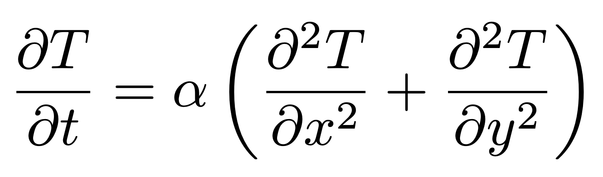

# Heat Diffusion: A Visual Physics Simulator
This project is an interactive real-time simulation of the 2D heat diffusion equation, a fundamental partial differential equation (PDE) that governs the distribution of temperature in a given medium over time.
At its core, it numerically solves the heat equation:

  

where:

𝑇 (𝑥, 𝑦, 𝑡) is the temperature at time 𝑇 and position (𝑥 ,𝑦)

A constant specific to a given fundamental terms, 𝛼 is the thermal diffusivity.

By implementing finite difference techniques to discretize the continuous equation, the simulation allows users to interact with the mouse to "transmit energy" (heat) into the system, simulating a localized heat source.

# Why I Built This 
As someone who has always been passionate about physics, I wanted to bring together my technical skills and the foundational concepts I learned in my early education.
This project started with the idea of ​​visualizing what physics, which I once saw as just formulas, might look like in the real world by using Matplotlib.

By turning thermal diffusion into an interactive canvas, I aimed to make the simulation more playfull. This approach allowed me to explore the artistic potential of numerical methods, while also implementing practical extensions like saving temperature matrices and building a user gallery system using TinyDB and .npy properties

# Creative Collaboration
By enabling users to draw directly on the simulation grid, the project promotes creative engagement in addition to simulating physics.

With mouse movements, users add heat almost like using their hands, creating thermal patterns that resemble works of art.
